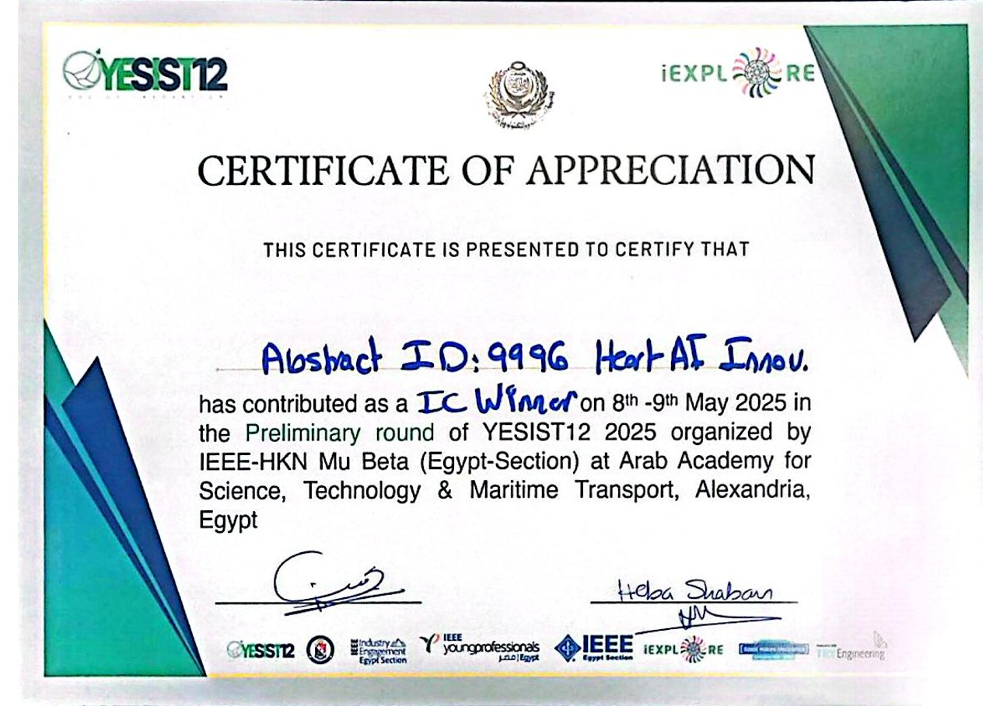
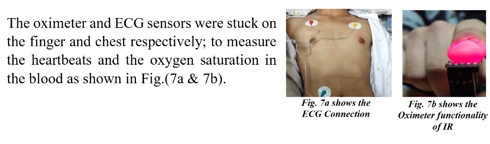
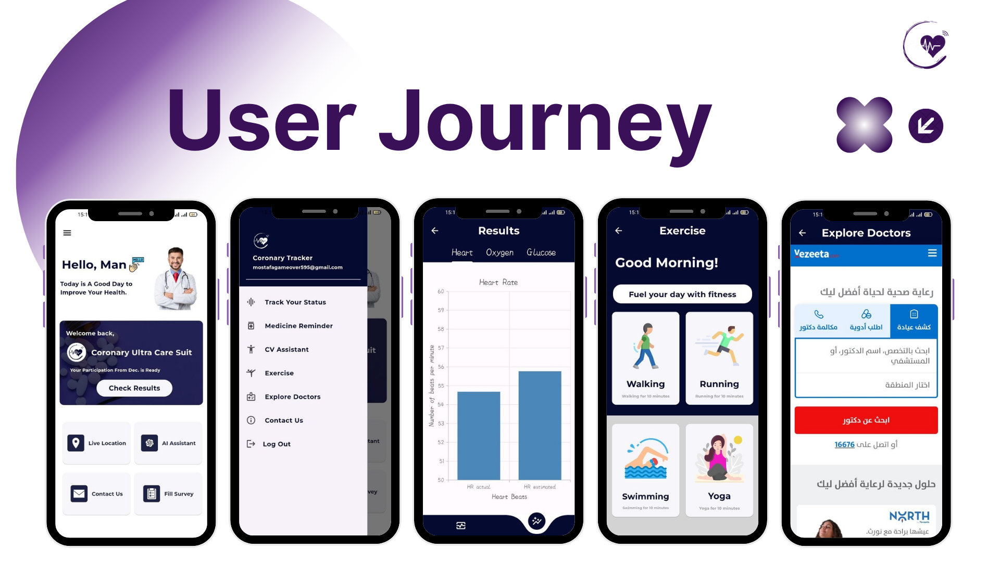

<div align="center">

# CoronaryAI Vest

### Real-Time Wearable Cardiac Monitoring

**Biomedical Engineering · Embedded Systems · Signal Processing · Edge AI · Flutter**

[](./docs/awards/1st_place_certificate.jpeg)
[](#system-architecture)
[](#mobile-application)

<p>
  A wearable prototype combining ECG acquisition, real-time signal processing, embedded AI, and a companion mobile application.
</p>

</div>

---

## 🏆 Project Highlight

<table align="center">
<tr>
<td align="center" style="border: 1px solid #d0d7de; border-radius: 8px; padding: 18px;">

### 1st Place — IEEE YESIST12 2025

**Regional Round** · *Heart AI Innov.* · Abstract ID **9996**

**Qualified for the International Round in Malaysia**

<br>



</td>
</tr>
</table>

---

## Overview

**CoronaryAI Vest** is a wearable cardiac monitoring prototype developed to explore continuous physiological-data collection and real-time analysis in a portable system.

The project brings together custom wearable hardware, ECG acquisition, digital signal processing, embedded AI, Bluetooth Low Energy communication, and a Flutter mobile application.

---

## Development Timeline

The project was developed in stages, moving from the initial concept to a working wearable prototype and connected application.

| Stage | Focus | Result |
|:---:|---|---|
| **01** | **Concept** | Defined the wearable cardiac-monitoring idea and system requirements |
| **02** | **System Design** | Planned sensing, embedded processing, communication, and application layers |
| **03** | **Hardware** | Integrated ECG electrodes, sensors, embedded electronics, and wearable structure |
| **04** | **Signal Processing** | Implemented filtering, QRS detection, R-peak detection, and heart-rate calculation |
| **05** | **Edge AI** | Developed a lightweight CNN pipeline for selected rhythm abnormalities |
| **06** | **Mobile App** | Built the Flutter interface and BLE data connection |
| **07** | **Prototype & Testing** | Combined the subsystems and evaluated the complete prototype |
| **08** | **Competition** | Presented the project at IEEE YESIST12 2025, achieved 1st place, and qualified for the International Round in Malaysia |

---

## Prototype

<table align="center">
<tr>
<td align="center" style="border: 1px solid #d0d7de; padding: 8px;">

</td>
<td align="center" style="border: 1px solid #d0d7de; padding: 8px;">

</td>
<td align="center" style="border: 1px solid #d0d7de; padding: 8px;">

</td>
</tr>
</table>

The prototype combines the textile vest, sensing electrodes, embedded electronics, and supporting hardware into one wearable platform.

---

## System Architecture

<div align="center">

```text
        ┌─────────────────────────────┐
        │       WEARABLE VEST         │
        │   ECG + Physiological Data  │
        └──────────────┬──────────────┘
                       │
                       ▼
        ┌─────────────────────────────┐
        │       EMBEDDED SYSTEM       │
        │ Filtering · QRS · Edge AI   │
        └──────────────┬──────────────┘
                       │ BLE
                       ▼
        ┌─────────────────────────────┐
        │        FLUTTER APP          │
        │ Live Data · Trends · Alerts │
        └─────────────────────────────┘
```

</div>

### 01 · Wearable Hardware

- Custom textile vest designed around electrode placement
- Multi-lead dry electrodes for ECG acquisition
- Heart-rate and SpO₂ sensing
- Experimental NIR-based glucose and cholesterol estimation
- Micro-pump mechanism for the project's emergency-response concept

### 02 · Signal Processing

- Digital band-pass filtering
- Notch filtering for power-line interference
- Baseline-drift reduction
- Pan-Tompkins-based QRS detection
- R-peak detection and heart-rate calculation

### 03 · Edge AI

A lightweight CNN is used to classify selected cardiac rhythm abnormalities, including **AFib** and **PVCs**, with the processing pipeline designed around embedded-system constraints.

### 04 · Bluetooth Communication

Processed measurements are transmitted from the embedded system to the mobile application using **Bluetooth Low Energy (BLE)**.

---

## Mobile Application

<table align="center">
<tr>
<td align="center" style="border: 1px solid #d0d7de; padding: 8px;">

</td>
</tr>
</table>

The Flutter application provides a simple interface for viewing incoming wearable data and interacting with the monitoring system.

**Main interface features:**

- Live cardiac data and waveform display
- Actual vs. estimated measurements
- Trend and activity tracking
- Medication reminders
- AI-assisted guidance
- Telemedicine and emergency-location features

---

## Experimental Measurements

The project also explores NIR-based estimation of **glucose and cholesterol** using 660 nm and 940 nm light sources.

> These are **experimental estimates only** and are not intended to replace clinical measurements or diagnostic equipment.

---

## Documentation & Project Files

```text
CoronaryAI-Vest-Real-Time-Cardiac-Wearable/
│
├── README.md
│
├── docs/
│   ├── technical/
│   │   └── Real-Time_Wearable_T-Shirt_for_Cardiac_Monitoring_Formal_Report.pdf
│   │
│   ├── analysis/
│   │   └── analysis_overview_report_summary.png
│   │
│   ├── brochure/
│   │   └── project_brochure.jpeg
│   │
│   └── awards/
│       └── 1st_place_certificate.jpeg
│
└── media/
    ├── prototype/
    │   ├── ieee_coronary_vest_prototype.png
    │   ├── execution_1.png
    │   └── execution_2.png
    │
    └── app/
        └── coronary_app_dashboard.png
```

### Documentation

- [Technical Report](./docs/technical/Real-Time_Wearable_T-Shirt_for_Cardiac_Monitoring_Formal_Report.pdf)
- [System Analysis](./docs/analysis/analysis_overview_report_summary.png)
- [Project Brochure](./docs/brochure/project_brochure.jpeg)
- [IEEE YESIST12 Certificate](./docs/awards/1st_place_certificate.jpeg)

---

## Team

**Ahmed Khaled · Mohamed Hatem · Mostafa Ibrahim**

Hadayek October, Giza, Egypt  
`cucs.cad@gmail.com`

---

## Disclaimer

CoronaryAI Vest is an **engineering research and prototyping project**. It is not a certified medical device and should not be used for clinical diagnosis or treatment.

---

<div align="center">

**Built from concept → hardware → signal processing → AI → mobile application → working prototype.**

<sub>Biomedical Engineering · Embedded Systems · Signal Processing · Edge AI · Mobile Development</sub>

</div>
