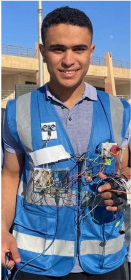

# CoronaryAI Vest — Real-Time Cardiac Wearable
**Biomedical Engineering | Edge AI & Signal Processing | Embedded Firmware | Mobile UI**

Welcome to the engineering documentation hub for the CoronaryAI Vest (Coronary Ultra-Care Suite - CUCS). This repository showcases the end-to-end development of an intelligent, wearable medical life vest designed to mitigate the risks of Coronary Artery Disease (CAD). The system spans multi-parametric physiological sensing (ECG, SpO2, glucose, and cholesterol), real-time digital signal processing (DSP), edge machine learning for arrhythmia classification, automated emergency therapeutic dosing, and a cross-platform mobile health (mHealth) ecosystem.

🏆 **1st Place Project Award:** Recognized for excellence in biomedical engineering and edge AI implementation as the **1st Place Winner** in the regional round of **IEEE YESIST12 2025** (Abstract ID: 9996 | Topic: Heart AI Innov.). Organized by IEEE-HKN Mu Beta (Egypt Section) at the Arab Academy for Science, Technology & Maritime Transport, Alexandria, Egypt. [View Certificate](./1st_place_certificate.jpeg)

---

## 🎥 System Operation & Prototype

*Fully integrated CoronaryAI Vest prototype worn on-body, demonstrating the ergonomic textile design, multi-lead dry-electrode placement, and onboard processing housing.*

---

## 📱 Mobile App Ecosystem & User Journey

*The 5-stage patient mobile interface featuring real-time diagnostic telemetry, dynamic actual vs. estimated heart rate visualization, AI fitness coaching, and localized telemedicine integration.*

---

## 📄 Core Project Assets
* 🚀 **[Click Here to View the Full Technical Report](./Real-Time_Wearable_T-Shirt_for_Cardiac_Monitoring_-_Formal_Report.pdf)**
* 📱 **[View High-Res Mobile App Dashboard](./coronary_app_dashboard.png)**
* 💻 **[View Core Firmware Implementation Snippet](#3-embedded-software--wireless-telemetry)**

---

## ⚙️ Core Engineering Achievements

### 1. Biomedical Hardware & Multi-Parametric Sensing
* **Wearable Architecture:** Engineered an ergonomic textile life vest tailored for patients with Coronary Artery Disease (CAD), implementing dry-electrode arrays to capture multi-lead biopotentials while minimizing motion artifacts during active daily mobility.
* **Therapeutic Automation:** Integrated a custom, manually-fabricated micro-gas pump designed to automatically dose a fast-acting anti-coma gas payload during acute emergency thresholds, preventing sudden, dangerous glucose fluctuations.
* **Multi-Parametric Verification:** Evaluated hardware response times across continuous telemetry metrics, including heart rate fluctuations, oxygen saturation ($SpO_2$), estimated glucose levels, and localized cholesterol trends.

### 2. Real-Time Signal Processing & Machine Learning
* **DSP Filter Pipeline:** Developed high-attenuation digital bandpass and notch filters to clean incoming signals, neutralizing baseline wander and 50/60 Hz power-line interference.
* **QRS Complex Detection:** Implemented a hardware-optimized Pan-Tompkins style algorithm for real-time R-peak tracking and instant heart rate estimation.
* **Edge AI Inference:** Trained a lightweight Convolutional Neural Network (CNN) compressed for low-power microcontroller environments, delivering high-accuracy, low-latency classification of critical cardiac anomalies (e.g., AFib, PVCs).

### 3. Embedded Software & Wireless Telemetry
* **Firmware Architecture:** Developed ultra-low-power firmware optimized for synchronous high-speed ADC polling, real-time algorithmic filtering, and safety-threshold evaluations within a strict deterministic time window.
* **Telemetry & Execution:**
  
  *Embedded implementation of the core execution loop managing raw telemetry streams, handling edge inference routines, and packaging encrypted health data packets for Bluetooth Low Energy (BLE) broadcasting.*

### 4. Cross-Platform Mobile Application (mHealth)
* **Real-Time Visualization:** Programmed a mobile dashboard that continuously decodes BLE telemetry, rendering live cardiac waveforms and comparative tracking graphs (Actual vs. Estimated metrics).
* **Patient-Centric Modules:** Integrated a comprehensive patient suite featuring an AI medical assistant, structural medicine reminder schedules, localized weather/fitness logs (Walking, Running, Swimming, Yoga), and localized telemedicine API maps for immediate emergency physician routing.

---

## 👥 Core Project Contributors
Developed by the engineering team:
* **Ahmed Khaled**
* **Mohamed Hatem**
* **Mostafa Ibrahim**
* 📧 Contact: `cucs.cad@gmail.com`
* 📍 Project Origin: Hadayek October, Near Zewail City, 6th of October, Giza Governorate, Egypt.

---

## 📂 Repository Contents
* `Real-Time Wearable T-Shirt for Cardiac Monitoring - Formal Report.pdf` — Comprehensive engineering blueprint containing schematics, PCB layouts, and clinical validation metrics.
* `ieee_coronary_vest_prototype.png` — On-body hardware capture showing the fully integrated vest electronics and ergonomic textile layout.
* `coronary_app_dashboard.png` — High-resolution layout of the complete mobile UI/UX user journey.
* `1st_place_certificate.jpeg` — Official IEEE YESIST12 2025 1st Place award certification.
* `firmware_snippet.png` — High-resolution layout of the core embedded C/C++ firmware control loop.
