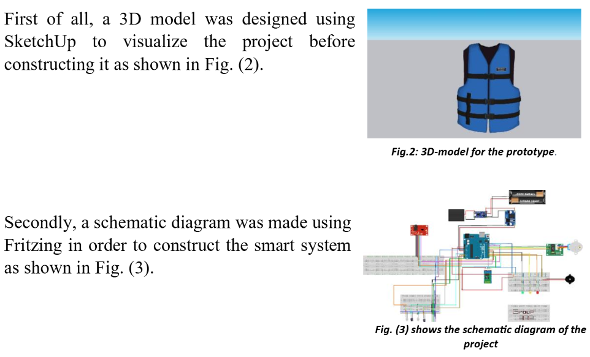

# CoronaryAI Vest — Real-Time Cardiac Wearable

**Biomedical Engineering · Embedded Systems · Signal Processing · Edge AI · Mobile App**

CoronaryAI Vest is a wearable cardiac monitoring prototype that brings ECG and other health measurements into one portable system. The project combines custom hardware, embedded firmware, real-time signal processing, machine learning, and a Flutter mobile application.

The prototype was developed as an engineering project focused on continuous cardiac monitoring and rapid response to abnormal readings.

🏆 **1st Place — IEEE YESIST12 2025**  
Regional round winner in the **Heart AI Innov.** topic. Abstract ID: 9996. The project was recognized by IEEE-HKN Mu Beta (Egypt Section) at the Arab Academy for Science, Technology & Maritime Transport, Alexandria, Egypt. [View Certificate](./1st_place_certificate.jpeg)

---

## Project Files

- 📄 **[Technical Report](./Real-Time_Wearable_T-Shirt_for_Cardiac_Monitoring_Formal_Report.pdf)** — Full project report, including system design, hardware, and testing.
- 📱 **[Mobile App Dashboard](./coronary_app_dashboard.png)** — Overview of the mobile application interface.
- 📊 **[System Analysis](./analysis_overview_report_summary.png)** — Summary of the system requirements and analysis.
- 📘 **[Project Brochure](./project_brochure.jpeg)** — Project overview and main specifications.
- 🏆 **[Award Certificate](./1st_place_certificate.jpeg)** — IEEE YESIST12 2025 first-place certificate.

---

## Prototype

The prototype combines the wearable textile, dry electrodes, sensing hardware, and processing electronics into a single vest designed for on-body use.

---

## Mobile Application

The companion Flutter application receives data from the wearable and presents it in a patient-facing interface. It includes live cardiac data, trend graphs, activity tracking, reminders, and telemedicine features.

---

## Main System Components

### 1. Wearable Hardware

- Custom wearable vest designed around the placement of the sensing electrodes.
- Multi-lead dry electrodes for ECG acquisition.
- Sensors for heart rate, SpO₂, glucose estimation, and cholesterol estimation.
- NIR-based sensing using 660 nm and 940 nm light sources for experimental glucose and cholesterol estimation.
- Custom micro-pump mechanism for the project's emergency-response concept.

The glucose and cholesterol measurements are **experimental estimates**, not clinical diagnostic measurements.

### 2. Signal Processing and AI

- Digital band-pass and notch filtering for ECG signal cleanup.
- Removal of baseline drift and power-line interference.
- Pan-Tompkins-based QRS detection for R-peak and heart-rate calculation.
- Lightweight CNN model for classifying selected cardiac rhythm abnormalities such as AFib and PVCs.
- Signal processing and inference designed to run on embedded hardware with limited resources.

### 3. Embedded System

The firmware handles sensor data collection, signal processing, AI inference, threshold checks, and wireless communication. The system is designed to process incoming data in real time while keeping power requirements low.

### 4. Mobile Application

The mobile application was built with **Flutter** and communicates with the wearable through Bluetooth Low Energy (BLE).

Features include:

- Live cardiac data and waveform display
- Actual vs. estimated measurements
- Activity tracking
- Medication reminders
- AI-assisted user guidance
- Telemedicine and emergency-location features

---

## Team

Developed by:

- **Ahmed Khaled**
- **Mohamed Hatem**
- **Mostafa Ibrahim**

**Contact:** cucs.cad@gmail.com  
**Project Origin:** Hadayek October, Giza, Egypt

---

## Repository Contents

| File | Description |
| --- | --- |
| `Real-Time_Wearable_T-Shirt_for_Cardiac_Monitoring_Formal_Report.pdf` | Full technical report |
| `ieee_coronary_vest_prototype.png` | Prototype photo |
| `execution_1.png` | Prototype image |
| `execution_2.png` | Prototype image |
| `coronary_app_dashboard.png` | Mobile application dashboard |
| `analysis_overview_report_summary.png` | System analysis summary |
| `project_brochure.jpeg` | Project brochure and specifications |
| `1st_place_certificate.jpeg` | IEEE YESIST12 2025 award certificate |

---

## Note

CoronaryAI Vest is an engineering research and prototyping project. It is not a certified medical device and should not be used for clinical diagnosis or treatment.
